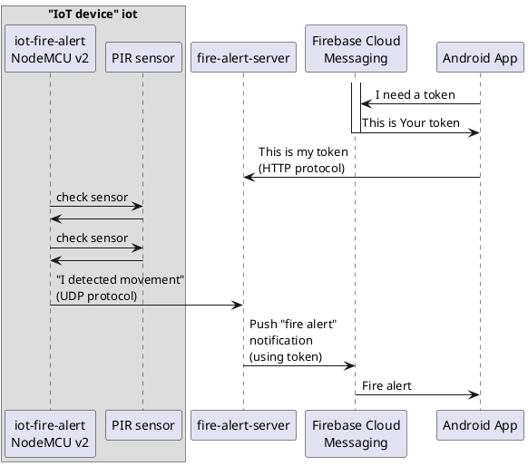

# fire-alert-server

This tool has a simple purpose: You want to get alerted that someone entered Your room :). When it happens, it triggers
an alarm on Your phone.

## Disclaimer

This tool was never meant for professional use and please do not evaluate my professional skills based on it :). I created it because my children requested to catch Santa while he is coming with Christmas gifts in the middle of the night. So I did (created the app, of course). Whether we caught the Santa is another story :). 

## Solution architecture



`iot-fire-alert` project is available at https://github.com/mwilkowski80/iot-esp-fire-alert.

`Android App` project is available at https://github.com/mwilkowski80/android-fire-alert.

## Getting started

Create a new environment for this project

```
python3 -m venv venv
source venv/bin/activate
pip install --upgrade pip setuptools wheel
pip install -r requirements.txt
```

Build a wheel artifact from this project:

```
source venv/bin/activate
python setup.py bdist_wheel
```

Copy the created wheel artifact to the server (where You want to run Your software), i.e.:

```
scp dist/*.whl yourservername:/serverpath/firealertserver/
```

SSH to Your server, i.e.:

```
ssh youruserattheserver@yourservername
```

Create a dedicated environment at the server path:

```
cd /serverpath/firealertserver/
python3 -m venv venv
source venv/bin/activate
pip install --upgrade pip setuptools wheel
pip install fastapi uvicorn pytest firebase-admin
```

This application uses Firebase Cloud Messaging: https://firebase.google.com/docs/cloud-messaging/. Set up a new account
there and generate a private key file (JSON file). It is explained
at https://firebase.google.com/docs/cloud-messaging/auth-server, subchapter *Provide credentials manually*. Copy this
JSON file to `/serverpath/private-key.json`

Configure the application as a service on the server. Here is an example on how You can configure it using
Linux [systemd](https://systemd.io/):

```
### Example of /etc/systemd/system/firealertserver.service
[Unit]
Description=firealertserver

[Service]
WorkingDirectory=/serverpath/firealertserver/
Environment=PYTHONPATH=firealertserver-0.1.0-py3-none-any.whl
Environment=GOOGLE_APPLICATION_CREDENTIALS=/serverpath/firealertserver/private-key.json
ExecStart=/serverpath/firealertserver/venv/bin/python3 -m firealertserver.main --udp-bind-address 0.0.0.0 --udp-bind-port 27654 --http-bind-address 0.0.0.0 --http-bind-port 27655 --services log,store,fire-alert
Restart=always
RestartSec=10s
User=mw

[Install]
WantedBy=multi-user.target
```

You can enable the above systemd by running:

```
sudo systemctl daemon-reload
sudo systemctl enable firealertserver.service
sudo systemctl start firealertserver.service
```

## Configuration

This server application opens UDP listening socket to wait for signal from the IoT device. You configure binding address
and port from the command line.

This server application opens HTTP listening socket to wait for a token from the Android App. You configure a binding
address and port from the command line. Token is stored in `<working_directory>/data/user-token.json`.

> **_Why not HTTPS:_** Well, I was a bit lazy :) and did not put enough effort on creating a proper certificate (i.e.
> using Let's Encrypt). If you want to contribute to this project by creating one, you're welcome to do so :).

You need to configure services which will be provided by this application using the `--services` option (check
the `systemd` example above). Currently, there are 3 types of services provided by the application

| Service name | Description                                                                                                                   |
|--------------|-------------------------------------------------------------------------------------------------------------------------------|
| store        | Stores alerts coming from the IoT device to `<working directory>/data/raw.csv` file. Currently, this path is non-configurable |
|log| Logs information about incoming alerts to STDERR|
|fire-alert   | Pushes notification to Firebase Cloud Messaging to trigger an alert on Android App|

You can configure multiple services using comma separated option, i.e. `--services log,store,fire-alert`

You can check all the available options by running:

```
PYTHONPATH=/serverpath/firealertserver/firealertserver-0.1.0-py3-none-any.whl \
    /serverpath/firealertserver/venv/bin/python3 \
    -m firealertserver.main --help 
```

## Known limitations

1. No HTTPS support
2. Only a single user support (`user-token.json` contains only a single token)
3. No authentication mechanism for UDP (mostly due to IoT device limitations)
4. No support for config file
5. No options to configure paths for tokens and storing incoming data.
